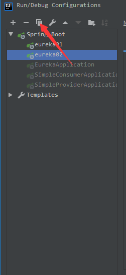
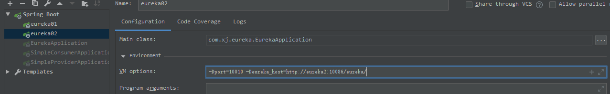

# Spring Cloud实战
当前项目`spring boot`版本`2.0.1`，`spring cloud`版本`Finchley.RC1`
## Eureka
#### 编写Eureka Server    
创建一个`spring boot`项目，引入相关依赖：
```xml
<parent>
    <groupId>org.springframework.boot</groupId>
    <artifactId>spring-boot-starter-parent</artifactId>
    <version>2.0.1.RELEASE</version>
</parent>
<dependencies>
    <dependency>
        <groupId>org.springframework.cloud</groupId>
        <artifactId>spring-cloud-starter-netflix-eureka-server</artifactId>
        </dependency>
        <dependency>
            <groupId>org.springframework.boot</groupId>
            <artifactId>spring-boot-starter-web</artifactId>
        </dependency>
</dependencies>

<dependencyManagement>
    <dependencies>
        <dependency>
            <groupId>org.springframework.cloud</groupId>
                <artifactId>spring-cloud-dependencies</artifactId>
                <version>Finchley.SR2</version>
                <type>pom</type>
                <scope>import</scope>
           </dependency>
        </dependencies>
</dependencyManagement>
```
编写启动类：
```java
@EnableEurekaServer
@SpringBootApplication
public class EurekaApplication {
    public static void main(String[] args) {
        SpringApplication.run(EurekaApplication.class,args);
    }
}

```
编写配置文件，因为`yml`文件可读性更高，结构清晰，所以这里使用`yml`类型的配置文件，配置如下：
```yaml
server:
  port: 10086
eureka:
  client:
    register-with-eureka: false
    fetch-registry: false
    service-url:
      defaultZone: http://localhost:10086/eureka
```
配置说明：

- eureka.client.register-with-eureka：表示是否将自己注册到Eureka Server，默认为true。由于当前服务就是Eureka Server，所以这里配置为false
- eureka.client.fetch-registry：表示是否从Eureka Server获取注册信息，默认为true。因为这是一个单点的Eureka Server，不需要同步其他结点的信息，所以配置为false
- eureka.client.service-url.defaultZone：设置与Eureka Server交互的地址，查询服务和注册服务都需要依赖这个地址。默认是`http://localhost/10086/eureka`,当有多个地址时使用`,`分割。

#将微服务注册到Eureka Server上
创建一个`spring boot`项目，添加一下依赖：
```xml
<dependency>
    <groupId>org.springframework.boot</groupId>
    <artifactId>spring-boot-starter-web</artifactId>
</dependency>
<dependency>
    <groupId>org.springframework.cloud</groupId>
    <artifactId>spring-cloud-starter-netflix-eureka-client</artifactId>
</dependency>
```
编写`yml`配置文件：
```yaml
server:
  port: 2008
spring:
    application:
        name: microserver-provider-user
eureka:
  client:
    service-url:
      defaultZone: http://localhost:10086/eureka
  instance:
    prefer-ip-address: true
```
配置说明：

- `spring.application.name`：用于指定注册到Eureka Server上的应用名
- `eureka.instance.prefer-ip-address`：表示是否将自己的IP注册到Eureka Server，不配置默认为false，则表示注册微服务所在操作系统的hostname到Eureka Server
编写启动类：
```java
@SpringBootApplication
@EnableDiscoveryClient
public class SimpleProviderApplication {
    public static void main(String[] args) {
        SpringApplication.run(SimpleProviderApplication.class,args);
    }
}
```
也可以用`@EnableEurekaClient`注解代替`@EnableDiscoveryClient`。在`spring cloud`中，微服务发现组件有多种选择，如`Zookeeper`等。`@EnableDiscoveryClient`为各种发现服务组件提供了支持，`@EnableEurekaClient`只表明是一个Eureka的Client。将这些配置好后就可以把服务注册到Eureka Server上了。可访问`http://localhost:10086/eureka/`查看。
### Eureka Server的高可用
微服务在消费远程API时总是使用本地缓存中的数据。因此一般来说，即使Eureka Server发生宕机，也不会影响到服务之间的调用。但如果Eureka Server宕机时，某些微服务也出现了不可用的情况，Eureka Client中的缓存若不被更新，就可能会影响到微服务的调用，甚至影响到整个应用系统的高可用性。因此，在生产环境中，通常会到微服务的调用，甚至影响到整个应用系统的高可用性。因此，在生产环境中，通常会部署一个高可用的Eureka Server集群。Eureka Server可以通过运行多个实例并相互注册的方式实现高可用部署，Eureka Server实例会彼此增量地同步信息，从而确保所有节点数据- -致。事实上，节点之间相互注册是Eureka Server的默认行为。
配置多个Eureka Server可以通过修改端口号或者配置启动参数来实现
- 修改端口
选中Eureka Server，然后复制它修改名字，如下图所示



修改第一个Eureka Server的配置文件，然后启动。第二个Eureka Server的配置文件只需要把`server.port`改成`10010`，把`eureka.client.server-url.defaultZone`中的端口号修改为`10086`，然后把`spring.application.name`修改为`eureka02`，最后启动服务即可
```yaml
server:
  port: 10086
eureka:
  client:
    register-with-eureka: true
    fetch-registry: true
    service-url:
      defaultZone: http://localhost:10010/eureka
spring:
  application:
    name: eureka02
```
- 通过启动参数配置
```yaml
server:
  port: ${port:10086}
eureka:
  client:
    register-with-eureka: true
    fetch-registry: true
    service-url:
      defaultZone: ${eureka_host:http://eureka02:10010/eureka}
```
启动第一个服务时可以不配置启动参数，启动时会默认使用配置文件中的。启动第二个Eureka Server时就需要配置启动参数了，启动参数会覆盖配置文件中`${}`的内容，启动参数：`-Dport=10010 -Deureka_host=http://eureka2:10086/eureka/`。
使用启动参数配置必须使用域名，需要在host文件中配置


### Eureka的自我保护
默认情况下,如果Eureka Server在一定时间内没 有接收到某个微服务实例的心跳, Eureka Server将会注销该实例(默认90秒)。但是当网络分区故障发生时，微服务与Eureka Server之间无法正常通信，以上行为可能变得非常危险了一-因为微服务 本身其实是健康的，此时本不应该注销这个微服务。
Eureka通过“自我保护模式”来解决这个问题一当 Eureka Server节点在短时间内丢失过多客户端时(可能发生了网络分区故障)，那么这个节点就会进入自我保护模式。一旦进人该模式，Eureka Server就会保护服务注册表中的信息，不再删除服务注册表中的数据(也就是不会注销任何微服务)。当网络故障恢复后，该Eureka Server节点会自动退出自我保护模式。
`eureka`默认是开启自我保护的，关闭自我保护需要配置：`eureka.server.enable-self-preservation: false`

## Ribbon
Ribbon是Netflix发布的负载均衡器，它有助于控制HTTP和TCP客户端的行为。为Ribbon配置服务提供者地址列表后，Ribbon就可基于某种负载均衡算法，自动地帮助服务消费者去请求。Ribbon 默认为我们提供了很多的负载均衡算法，例如轮询、随机等。当然，我们也可为Ribbon实现自定义的负载均衡算法。
在Spring Cloud中，当Ribbon与Eureka 配合使用时，Ribbon 可自动从Eureka Server获取服务提供者地址列表，并基于负载均衡算法，请求其中-一个服务提供者实例。
### 消费者整合`ribbon`
添加`ribbon`的依赖：
```xml
<dependency>
    <groupId>org.springframework.cloud</groupId>
    <artifactId>spring-cloud-starter-netflix-ribbon</artifactId>
</dependency>
```
修改启动类
```java
@SpringBootApplication
@EnableDiscoveryClient
public class SimpleConsumerApplication {
    public static void main(String[] args) {
        SpringApplication.run(SimpleConsumerApplication.class,args);
    }
    @Bean
    @LoadBalanced
    public RestTemplate restTemplate(){
        return new RestTemplate();
    }
}
```
修改`Controller`的代码：
```java
@Autowired
    private RestTemplate restTemplate;

    @Autowired
    private DiscoveryClient discoveryClient;

    @Autowired
    private LoadBalancerClient loadBalancerClient;

    private static final Logger LOGGER = LoggerFactory.getLogger(MovieController.class);

    @GetMapping("/user/{id}")
    public User getItem(@PathVariable("id") Long id) {
        return restTemplate.getForObject("http://microserver-provider-user/"+id,User.class);
    }

    @GetMapping("/user-instance")
    public List<ServiceInstance> showInfo(){
        return discoveryClient.getInstances("microserver-provider-user");
    }

    @GetMapping("/log-instance")
    public void logUserInstance(){
        ServiceInstance serviceInstance = loadBalancerClient.choose("microserver-provider-user");
        MovieController.LOGGER.info("{}:{}:{}",serviceInstance.getServiceId(),serviceInstance.getHost(),serviceInstance.getPort());
    }
```
原来代码中的请求地址使用的是主机名`localhost`，现在改成了`microserver-provider-user`，这是微服务的虚拟主机名（和服务名一致），`ribbon`和`eureka`配置使用时会自动将虚拟主机名映射成微服务的网络地址。
虚拟主机名中不能包好`_`之类的字符